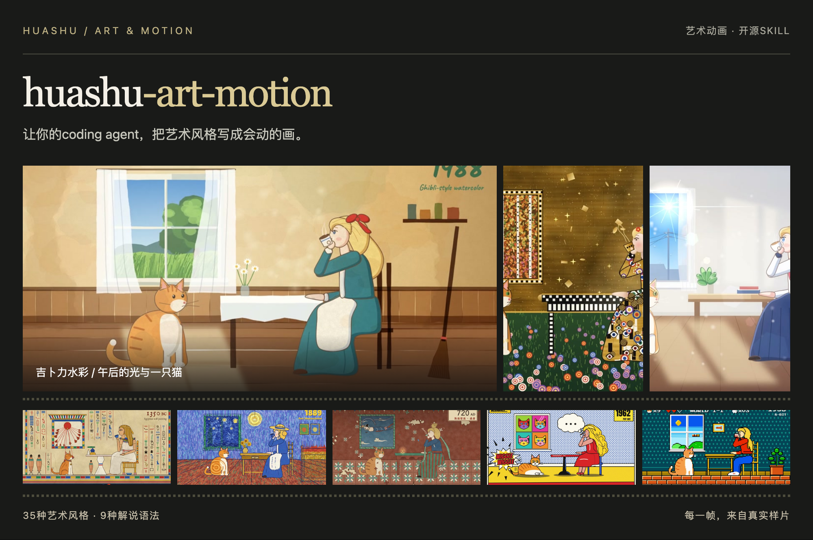
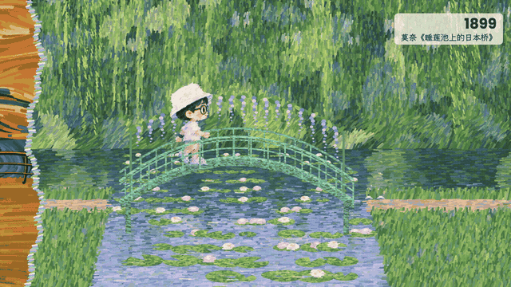
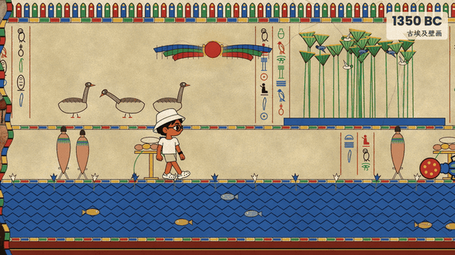
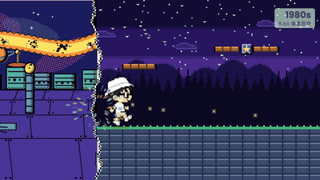
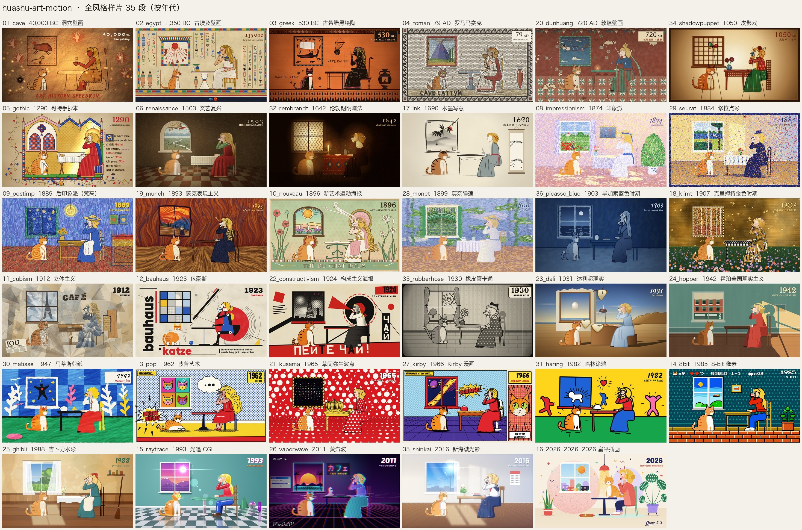
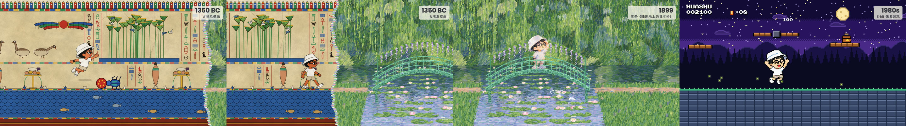
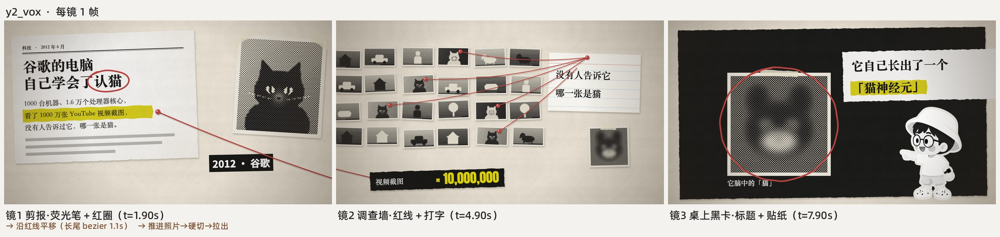
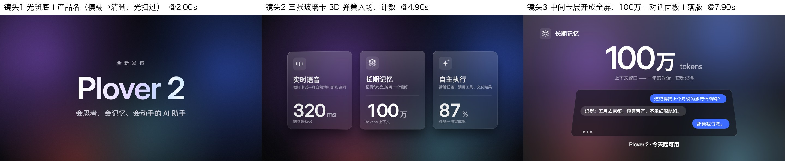

<div align="center">



# huashu-art-motion-optimized · 艺术动画优化版

让你的coding agent，把艺术风格写成会动的画。

35种艺术风格 · 9种解说语法 · 8种参数化片段 · 口播整片参考代码

```sh
npx skills add zhuy3075-ui/huashu-art-motion-optimized --skill huashu-art-motion
```

[来源与致谢](#原作者与上游来源) · [变更说明](#相对上游的变更说明) · [看动画](#动画样片) · [看风格](#看效果) · [开始使用](#里面有什么) · [下载完整样片](https://github.com/alchaincyf/huashu-art-motion/releases/latest)

</div>

## 这个优化版

基于[花叔原版](https://github.com/alchaincyf/huashu-art-motion)的独立优化版，保留原作者归属和许可证；新增逐步需求/全文确认、详细Style DNA、用户素材/角色库、火山逐字字幕与DubbingX可选配音，以及生图验收、按需能力检查、分范围偏好和批量创作队列。面向Codex GPT-6系列补充按阶段调用的提示词与实际确认问法。上方命令安装本仓库；预发布验证版本位于pre-release分支，安装时可将来源写成`https://github.com/zhuy3075-ui/huashu-art-motion-optimized/tree/pre-release`。运行需Python3.11+，图片工具建议使用uv声明依赖。全局私人config在安装目录外，升级不重置用户档案。

## 原作者与上游来源

特别感谢 **花叔 Huashu（[@AlchainHust](https://x.com/AlchainHust)，GitHub：[@alchaincyf](https://github.com/alchaincyf)）** 开源 [huashu-art-motion](https://github.com/alchaincyf/huashu-art-motion)。原项目提供了本仓库继承的代码动画引擎、35种艺术风格配方、9种解说语法、示范素材与创作方法。

本仓库是在原项目基础上持续维护的独立优化版，主要围绕需求引导、内容确认、个人风格与角色复用，以及媒体调用流程做补充。原作者的代码、文档和示范贡献归原作者；本版新增与借鉴部分在下面逐项说明，原LICENSE和字体、笔顺数据、角色示范的许可边界继续保留。

## 相对上游的变更说明

| 类型 | 本版变更 | 说明与入口 |
|---|---|---|
| 继承上游 | 代码动画引擎、35种画风、9种解说语法、示范片与原有QA方法 | 来自花叔原项目；保留源码、归属和许可，不计作本版新增 |
| 本版新增 | 逐步需求发现与完整文案确认 | 根据素材给参考并追问；简报、大纲、全文、分镜与样片逐步确认，已有明确授权直接沿用。[00号](references/00-需求引导与确认.md) |
| 本版新增 | 详细Style DNA与个人风格库 | 16维度规则、证据/未知项、提示词与实现映射；本地名称、别名、版本保存及复用。[13号](references/13-Style-DNA与本地风格库.md) |
| 本版新增 | 用户素材与个人角色库 | 原件保留、用途确认、母版身份约束、真实动作与版本；静帧/动作认可分别记录。[15号](references/15-用户素材与角色库.md) |
| 本版修改 | 透明素材处理与动作切帧 | 保留RGBA与半透明边缘，显式4×2八帧和来源坐标，脚底锚点需样稿核对。[素材工具](references/15-用户素材与角色库.md#透明图与动作帧工具) |
| 本版新增 | 火山异步配音及字幕时间轴 | 保留实际词表，导出MP3、原文SRT与镜头节拍；文案/读法不匹配时停止，不按字数估时。[14号](references/14-火山TTS与逐字字幕.md) |
| 本版新增 | DubbingX可选配音及音色历史 | 云端音色查询、异步生成/恢复/下载、成功历史；其音频需另做实际字幕对齐。[16号](references/16-DubbingX异步配音与音色历史.md) |
| 本版新增 | 批量创作与阶段调用 | 多选题、共享/单项配置、各支独立确认、实际产物哈希、串行领取与失败续做；由Codex调用现有制作工具。[18号](references/18-批量创作与调用.md) |
| 本版补充 | Codex GPT-6系列提示词与确认问法 | 需求、内容、个人资产、媒体和批量调用提示词；按阶段展示实际产物并提出确认问题，不自动切模型或宣称跨模型性能提升。[19号](references/19-Codex提示词与阶段确认.md) |
| 借鉴并适配上游 | 生图计划与产物验收、按需能力检查、分范围偏好 | 参考上游[f178bd7](https://github.com/alchaincyf/huashu-art-motion/commit/f178bd7754a71d6d399473af1501634548efa6cb)，适配本版两平台配音、角色/DNA流程与现有config；技术验收后仍视觉待审。[17号](references/17-能力检查生图验收与偏好.md) |

普通一次选择仅作用本次，用户明确“记住/以后默认”才写长期偏好；私人配置、音色、提示词与原素材存安装目录外，不随公开仓库分发。完整修改记录见[CHANGELOG](CHANGELOG.md)。

截至2026-10-09，本次批量更新已通过233项单测（新增33项队列测试）、55次离线CLI调用、技能格式/47个本地链接检查及独立代码/行为核验；真实双进程领取检查也通过。媒体能力更新此前另做过7次离线CLI检查。它们验证的是文件、参数与流程契约，真实配音听感、角色身份和批量成片质量仍需实际样稿评审。

上游最新[57d6760：Windows渲染/QA并发加载修复](https://github.com/alchaincyf/huashu-art-motion/commit/57d67608ab458f57d9b153b1a2831b921e22498b)尚未合入本版；本仓库没有完整移植上游系统配音、音色训练、补配拟合和发布门禁。后续按具体目标同步与验证，不将借鉴机制描述为全部原创，也不将本版标为与上游全功能一致。

## 动画样片

下列动画样片、风格总览及花叔角色示范沿用原作者的上游展示资源，用于展示原有代码动画体系；素材使用范围见[许可证](#许可证)。

画里真的会动。下面三段来自同一支穿越短片，场景用代码画，角色用生成帧合成。



日本桥上的一次水漂。

<table><tr>
<td width="50%"><br/>古埃及 · 圣甲虫</td>
<td width="50%"><br/>8-bit · 顶出金币</td>
</tr></table>

## 看效果



35段样片各取一帧：同一位少女、同一只橘白猫、同一张桌子，从公元前 40000 年的岩洞一路穿到 2026 年。每一段都在动：梵高的星空在转，马赛克的颜色从石块上流过去，水墨晕染把画面带进下一个时代。

👉 [下载全风格样片（MP4）](https://github.com/alchaincyf/huashu-art-motion/releases/latest)

长卷穿越片：一个人从左走到右，跨过边界的那一刻，世界和他自己的画风一起换（下图是收进仓库的 3 段示范：埃及壁画 → 莫奈《日本桥》→ 8-bit）：



8种解说语法各有一支可运行示范片（下图每镜取一帧）。此外还有第9种「讲解员式财经科普」，提供语法卡和需自备角色的整片代码快照。白板适合跟着口播画关系，Vox适合图形与信息拼贴：

| | |
|---|---|
|  Kurzgesagt：扁平无描边、尺度穿行 |  Vox：剪报、红线、荧光笔 |
|  白板：笔尖揭开线稿 |  3Blue1Brown：一个对象形变成下一个 |
|  Storytime：反应特写、笑点停顿 |  动态文字：主词砸进来 |
|  发布会：光斑底、毛玻璃卡、大数字 |  财经图表：先轴、后数据、只标一件事 |

---

## 能做什么

默认先逐步完善需求：**需求简报 → 内容大纲 → 完整文案 → 分镜与画风 → 短样片 → 整片**。每阶段先给可审阅内容，再按你的确认推进；不会因为选了画风，就把未确认文案做成配音。你不用懂动画术语，每轮只处理少量关键问题，并有具体选择与推荐。

提问会结合你提供的素材，先指出内容线索，再给适合这次任务的方向参考（示意开场、画面和取舍），用反问帮你判断想要的效果。选项和追问随你的回答变化，不是固定的类型问卷或画风菜单。

已有文案、口播或参考直接沿用；只做单片段、拆解或局部修改时缩短流程。你也可以明确说“文案由你定，不用确认”或“全部由你决定，直接做成片”，按委托范围跳过相应确认。详细规则见[需求引导与确认](references/00-需求引导与确认.md)。

| 你说 | 它做 |
|---|---|
| 「分析这些关键帧的style dna」「把我的风格保存下来」「用我已存的纸纹手绘风格」 | 提取16维度规则、证据与提示词，确认后存本地config，按名称/别名/版本复用 |
| 「批量做这些选题」「按我的风格和角色做系列」「继续上次批量创作」 | 建立本地任务队列，复用共享配置、保留单项例外；逐阶段给实际版本并提问确认，串行调用工具、保存进度与失败续做 |
| 「用我的自定义音色配音」「列出以前用过的音色」 | 先确定火山或DubbingX，必问自定义音色及具体ID，展示所选平台候选与历史；火山输出音频和真实时间轴/SRT，DubbingX生成音频后另做字幕对齐 |
| 「复刻这个动画」「拆一下这段」 | 先跑拆解脚本量出转场、节拍网格、每段运动热图，再按机制用代码复刻 |
| 「做个梵高／莫奈／包豪斯那种的动画」 | 先设计一帧，再让它动起来；35张风格配方卡当起点 |
| 「用我的口播做一段艺术动画」 | 镜头表 → 定风格 → 世界画布加镜头 → 输出一条画面轨 |
| 「做一个人穿过一幅幅名画的片子」 | 长卷骨架：每个世界一个段文件，主角一路往右走，跨边界换画风，镜头只进不退 |
| 「做解说视频的动画段」 | 按口播选语法，喂一份 JSON，出一段时长精确到帧的片段（横竖屏、可透明底） |
| 「画面里要有人」 | 沿用用户母版/真实帧库，缺动作才按已确认范围生成，代码负责合成 |
| 「配个乐、卡节奏」 | BPM 网格、动机换乐器、结尾音效序列，纯代码合成 |

交付前有一道数字验收：`qa.py` 量稳定、效率、动感、流畅及文字框景线索，再派一个没参与制作的 agent 只看成片挑问题。

## 批量创作与提示词调用

一次提供多个选题即可，例如：“把这三篇素材做成一个系列，共用我已存的纸纹风格和角色；先给三份文案逐项确认。”技能先确认任务清单和共用配置，再为每支片子保存简报、大纲、实际全文、分镜、声音、样片和候选整片的独立版本。可以一次确认明确展示的多份同阶段产物；未确认的内容保持待审。

批量工具保存任务、产物快照、哈希和进度；失败保留原操作引用，恢复优先查询原媒体任务，不自动再次付费。一个条目待确认或已核对确定失败终态时可以处理其他条目；状态未知的在途操作先恢复。共享配置只留本项目，平台切换不继承另一平台的音色ID。由当前Codex会话按队列调用既有脚本；本地队列本身不联网、不生成视频，也不在后台自动运行。

[批量方法与CLI](references/18-批量创作与调用.md) · [输入模板](assets/batch-creation.template.json) · [队列工具](scripts/batch_creation.py) · [阶段提问与调用提示词](references/19-Codex提示词与阶段确认.md)。提示词参考[OpenAI GPT-6 Astra技能指导](https://developers.openai.com/blog/rethinking-skills-and-prompts-for-gpt-6-astra)，采用按需读取和明确完成条件；目前没有GPT-6系列跨模型质量/速度测评。

```sh
python scripts/batch_creation.py --project "我的系列工程" init --file "我的系列工程/选题清单.json"
python scripts/batch_creation.py --project "我的系列工程" status
python scripts/batch_creation.py --project "我的系列工程" next
python -m unittest discover -s scripts/tests -p 'test_batch_creation.py'
```

## 保存与调用自己的风格

你可以先给参考帧、视频或自己的风格描述，不必先写整片文案。技能会逐项分析身份、色彩、明暗、形状、线条、材质、光照、构图、空间、角色、物件、文字、动作、转场、后期和跨镜头一致性；区分实际观察、用户定义、推测与未知，用针对素材的反问帮助你选定核心特征。

详细DNA、纯风格提示词、图像/动作模板和实现说明一起保存到`~/.codex/config/huashu-art-motion/`；设置CODEX_HOME时使用它下面的`config/huashu-art-motion/`。名称与别名支持中文；修改追加版本，旧版保留。个人档案独立于技能发布配方，草稿/已确认与未测试/静态测试/动态测试分别记录。

调用示例：“列出我的风格”“用纸纹手绘风格做这段”“用warm-paper第1版”“本片减少颗粒，原风格不改”。具体命令由Codex执行，你无需手写JSON。只有静帧时不会猜测动画时序；选择已有风格仍需确认未定文案。[详细方法](references/13-Style-DNA与本地风格库.md) · [配置模板](assets/style-dna.template.json) · [风格库工具](scripts/style_library.py)。

```sh
python scripts/style_library.py list --include-builtins
python scripts/style_library.py show "warm-paper@1"
python -m unittest discover -s scripts/tests -p 'test_style_library.py'
```

`warm-paper`只是调用格式示例。首次初始化是空库，具体个人风格需要你的素材或定义；不会把示例当作已经识别并保存的风格。

---

## 配音平台与字幕

支持火山TTS与DubbingX两种可选渠道；沿用已选平台，未定时结合你已有的音色库和字幕需求给具体选择。两平台的API Key、音色ID和成功历史分别保存；不会自动切换或同时合成。

### 火山配音与逐字字幕

接入火山豆包2.0异步TTS，同一任务生成MP3、真实句/字级时间轴和原文SRT；动画关键词与镜头节拍使用返回时间。需求阶段必问是否用自定义音色及具体speaker；先展示本账号控制台导入库和成功历史，确认文案、读法与短试听后制作。

官方音色用`seed-tts-2.0`，复刻音色用`seed-icl-2.0`。API Key从本机环境变量读取，Windows可用DPAPI加密保存。音色ID从火山控制台导入，当前接口没有账号音色枚举能力，不能承诺自动下载云端列表。私人配置、音色库和成功历史在本地config的`volcengine/<账号>/`中，不进入技能包。数字/缩写转写不匹配会停止并保留结果，不能按字数猜时间或自动再合成。

```powershell
python scripts/volcengine_tts.py --account my-voice voices
python scripts/volcengine_tts.py --account my-voice history
python -m unittest discover -s scripts/tests -p 'test_volcengine_tts.py'
```

[完整流程与调用](references/14-火山TTS与逐字字幕.md) · [请求模板](assets/volcengine-request.template.json) · [调用脚本](scripts/volcengine_tts.py)。需要ffmpeg/ffprobe。已有口播直接沿用；当前项目需显式绑定时间轴与字幕，不自动改写示范工程。离线测试不代表真实账号联调成功。

### DubbingX异步配音

恢复原有异步音频生成脚本：查询/同步云端自训练与公共音色、读取历史、核对情绪、提交任务、恢复轮询、下载WAV或MP3并验证音频。需求阶段仍须选择自定义音色及真实voiceId，实际文案和本次试听/整段生成分别确认。已保留的本机配置可以继续使用，无需把密钥写入技能包。

```powershell
python scripts/dubbingx_tts.py --account my-library cached-voices
python scripts/dubbingx_tts.py --account my-library history
python scripts/dubbingx_tts.py --account my-library sync-voices
python -m unittest discover -s scripts/tests -p 'test_dubbingx_tts.py'
```

`my-library`是账号别名示例，沿用已有别名；首次配置见16号。DubbingX接口不返回逐字时间戳，字幕需对生成音频另做实际转录/对齐，不能直接套火山时间轴。[完整调用与恢复](references/16-DubbingX异步配音与音色历史.md) · [请求模板](assets/dubbingx-request.template.json) · [生成脚本](scripts/dubbingx_tts.py)。模拟测试不代表真实生成已成功。

## 用户图片与个人角色库

图片导入后先说明原样出镜、仅作参考或允许改绘的具体方式，再按已确认选择处理。支持素材格式/透明度检查、原件字节保留与来源清单；透明角色直接合成，4×2动作图按八帧切分。单张图片不会自动成为完整走路/口型素材，普通照片不自动套绿幕抠图。

个人角色档案记录身份保留项、允许/禁止变化、母版与真实动作帧，按名称和不可覆盖版本复用。原件副本在本地config，项目导出固定character_id@revision；实际角色/背景合成样稿认可与档案保存分开，不放行未确认的整片文案。详见[15号素材与角色库](references/15-用户素材与角色库.md)及[角色模板](assets/character-profile.template.json)。

```powershell
uv run scripts/image_assets.py inspect '项目/角色.png'
uv run scripts/character_library.py list
uv run scripts/character_library.py export '我的角色@1' --out '新项目/素材/角色v1'
```

首次库为空；图片工具使用Pillow/NumPy，uv按脚本声明加载，不需要把私人素材打入技能包。

## 媒体能力、生图验收和偏好

只有需要新配音/生图时检查对应能力；已有音轨/原图直接沿用。状态检查不联网、不解密、不合成；configured_unverified不代表真实账号可用。生图采用计划→Agent实际工具调用→回执/产物验收，检查参考哈希、尺寸、透明度和当前工具，再复制到项目；技术合格后仍需看图核对身份和画风。

本次选择覆盖项目、项目覆盖用户默认。普通选择只作用本次，用户明确“记住/以后默认”才保存长期媒体偏好；它不保存Key或授予云调用权，禁止项跨层合并。继续使用现有CODEX_HOME/config/huashu-art-motion，平台音色、角色和DNA不迁移。

```powershell
python scripts/capabilities.py status --capability voice
python scripts/media_preferences.py show
uv run --with pillow --with numpy python -m unittest discover -s scripts/tests -p 'test_*.py'
```

[17号完整使用](references/17-能力检查生图验收与偏好.md) · [图片请求模板](assets/generated-image-request.template.json) · [回执模板](assets/generated-image-receipt.template.json)。首次无偏好时明确显示待选择，不自动配置或调用。正式测试使用临时目录、模拟HTTP/工具声明和合成图，不消耗媒体额度，也不代表真实生成效果。

## 里面有什么

| | 数量 |
|---|---|
| 艺术风格配方卡（参数、母题动作、签名转场、当前短板） | 35张，`references/风格配方/` |
| 对应的场景代码 | 35个，`scripts/engine/scenes/` |
| 解说动画语法卡 | 9份；其中8种附示范片、参数化片段与示例spec |
| 口播整片参考代码 | 混合风格、白板、Vox、讲解员；需自备部分素材，详见目录README |
| 长卷穿越片示范（骨架＋3 段＋角色帧库） | 1 支，`scripts/engine/demos/long_scroll/` |
| 转场 | 艺术风格签名转场与解说转场，包含淡入、硬切和纸面转场 |
| 绘画与动画库（笔刷、渲染器、后期、骨架、镜头、图表、排版……） | 17 个，`scripts/engine/lib/` |
| 方法文档（需求引导、用户素材/角色库、Style DNA、火山逐字配音、DubbingX异步配音、拆解、机制、纯代码绘制、节奏配乐、角色、长卷……） | 18篇，`references/00`–`17` |

```
huashu-art-motion/
├── SKILL.md                 # 先引导需求与确认，再按任务读制作方法
├── references/              # 00–17方法文档、35张风格配方卡、9张语法卡、正面经验
├── assets/                  # 总览图与Style DNA草稿模板
└── scripts/
    ├── engine/              # 可整个复制走的动画工程：引擎、转场、库、场景、示范片、片段
    ├── analyze/breakdown.py # 把参考动画拆成「能写代码的地图」
    ├── qa.py                # 一键验收
    ├── style_library.py     # 本地风格库：查询、校验与不可覆盖版本保存
    ├── volcengine_tts.py    # 火山异步配音、真实时间轴与SRT、音色历史
    ├── dubbingx_tts.py      # DubbingX异步音频生成、云端音色查询与历史
    ├── capabilities.py     # 只读按需能力与缺口检查
    ├── generated_images.py # 生图计划与实际产物技术验收
    ├── media_preferences.py # 本次/项目/用户偏好及来源
    ├── image_assets.py      # 检查图片、复制原件并建立项目素材清单
    ├── character_library.py # 本地角色身份/母版/动作、版本保存与项目导出
    ├── audio/               # 纯代码合成配乐的模板
    └── font_subset.py ...   # 字体子集、绿幕抠图
```

依赖：[uv](https://docs.astral.sh/uv/)、ffmpeg、Playwright Chromium（第一次跑 `uv run --with playwright playwright install chromium`）。试一下：

```sh
cd huashu-art-motion
uv run --with playwright python scripts/engine/render.py --solo 09_postimp --stills 0.3 --out 试渲   # 梵高那一段的一帧
uv run --with playwright python scripts/engine/render.py --spec scripts/engine/examples/t3_finance_chart.json --out 财经图表.mp4
```

---

## 原作者的项目故事

以下保留花叔对原项目的创作经历，第一人称叙述指原作者；本优化版的开发范围见上方变更说明。

2026 年 10 月初，我在 X 上看到 Tak（[@cherry_mx_reds](https://x.com/cherry_mx_reds/status/2106095190285144331)）的一支 15 秒动画：一位少女和一只猫穿过 40000 年艺术史，每个时代只有一秒左右，但画里的东西都在动。

我让 Claude 复刻它。第一版是「一张张画之间做转场」，被我否了：原片每个时代可能就一秒，但画里的元素完全是流动的。于是改成先拆解（量转场、拟合节拍网格、看每段哪里在动），再用代码一层层把画画出来、让它动起来。

做的过程中我跟它说：「我们不只是为了复刻，我需要你积累经验。」所以这个 skill 里记的不只是代码，还有哪些做法被证明有效（`references/07-正面经验.md`）、每种风格的坑和短板。之后又派了 4 组只读 skill 的 agent 去做它没见过的 20 种风格，把它们各自造的轮子收成统一的库；再加上 8 种 YouTube 解说动画语法，接进了我自己的口播视频管线。最后用同一套东西做了《花叔穿越名画》：23种画风、2分08秒，我从洞穴一路走到 2026，骨架和其中 3 段也收进来了。

---

## 致谢

- **花叔 Huashu（[@AlchainHust](https://x.com/AlchainHust)）**：感谢原项目的代码、风格配方、解说语法、示范及方法论，以及后续媒体能力机制；[上游仓库](https://github.com/alchaincyf/huashu-art-motion)是本优化版的来源。
- **Tak（[@cherry_mx_reds](https://x.com/cherry_mx_reds)）** 的《Art History Speedrun》是这个 skill 的起点。16 个艺术时代的场景构图和「少女＋猫穿越」的设定沿用了原片的思路，画面全部用代码重新画，配乐脚本里是原创示例乐谱（只保留拆解方法，不保留对原曲的转录）；仓库里不含原片的帧、截图或音频文件。想看原作请去他的 X。
- 解说语法卡里拆解过的频道和资料（Kurzgesagt、Vox、3Blue1Brown、RSA Animate、TheOdd1sOut 等）都在各张卡的「一手参考」里给了链接，仓库只记测量出来的参数，不含他们的画面。
- 字体都是 SIL OFL 1.1 开源字体，清单和版权见 `scripts/engine/lib/fonts/LICENSES.md`。

---

## 关于原作者

| | |
|:---|:---|
| 🌐 官网 | [bookai.top](https://bookai.top) · [huasheng.ai](https://www.huasheng.ai) |
| 𝕏 Twitter | [@AlchainHust](https://x.com/AlchainHust) |
| 📺 B站 | [花叔v](https://space.bilibili.com/14097567) |
| ▶️ YouTube | [@Alchain](https://www.youtube.com/@Alchain) |
| 📕 小红书 | [花叔](https://www.xiaohongshu.com/user/profile/5abc6f17e8ac2b109179dfdf) |
| 💬 公众号 | 微信搜「花叔」 |

## 许可证

代码和文档：MIT。随便用，随便改，随便造。

例外：笔顺衍生数据`reference_films/spacex/spacex_wb/assets/strokes.js`沿用Arphic Public License（原文随文件附带）；`scripts/engine/lib/fonts/` 里的字体沿用各自的 OFL 许可；花叔的卡通形象与角色帧（`scripts/engine/demos/_shared/hero/`、`scripts/engine/demos/long_scroll/frames/`、`assets/角色/`）以及总览图、示范视频中包含的同一形象，只用于本 skill 的示范，不随 MIT 授权用于其他用途。

---

<div align="center">

**[女娲](https://github.com/alchaincyf/nuwa-skill)** 造 Skill。**[达尔文](https://github.com/alchaincyf/darwin-skill)** 让 Skill 进化。**艺术动画** 让画动起来。

MIT License © [花叔 Huashu](https://github.com/alchaincyf)

</div>

---

<div align="center">
<sub>作者的其他项目 · also by 花叔</sub>

[](https://github.com/alchaincyf/fanbox)

</div>

---

## English

This repository is an independently maintained adaptation of [Huashu’s original huashu-art-motion](https://github.com/alchaincyf/huashu-art-motion). Credit for the inherited animation engine, style recipes, demo assets and original methods belongs to Huashu. This edition adds guided discovery and script approval, personal Style DNA and character libraries, and async voice/subtitle workflows; its media planning and preference mechanisms are adapted from upstream. See the change table above and CHANGELOG for attribution and implementation scope. Original license notices and demo-asset restrictions remain in place.

**huashu-art-motion** is an agent skill for making animation with code, where the paintings actually move. It ships 35 art-style recipes (cave painting, Egyptian murals, Van Gogh, Klimt, Bauhaus, Kirby comics, 8-bit, vaporwave, Shinkai and more), each with a working Canvas scene, a style "renderer" and a signature transition; 8 explainer-video grammars (Kurzgesagt, Vox, whiteboard, storytime, kinetic type, 3Blue1Brown, keynote UI, finance charts) with demo films and parameterized clips you drive with a JSON spec, frame-accurate and in landscape, portrait or alpha; a long-scroll skeleton where a character walks left to right through one painting after another (3 sample worlds included); plus a breakdown script that maps a reference animation into cuts, beat grid and motion heatmaps, and a QA script that measures stability, cost per frame, motion and smoothness.

It started as a code-only recreation of Tak's ([@cherry_mx_reds](https://x.com/cherry_mx_reds/status/2106095190285144331)) 15-second *Art History Speedrun*. The scene layouts and the girl-and-cat premise follow his original; every frame here is redrawn in code, and no frames, screenshots or audio from the original are included.

Install: `npx skills add zhuy3075-ui/huashu-art-motion-optimized --skill huashu-art-motion`. Requires uv, ffmpeg and Playwright Chromium. The skill content is in Chinese. The ninth grammar, presenter-led explainers, ships as a reference implementation and requires your own character assets. Full-narration examples are code snapshots, not ready-to-render projects. Code and docs are MIT; the bundled stroke medians retain the Arphic Public License; bundled fonts keep their SIL OFL licenses; the Huashu character artwork, including its appearance in overview images and demo videos, is for demo use only.
